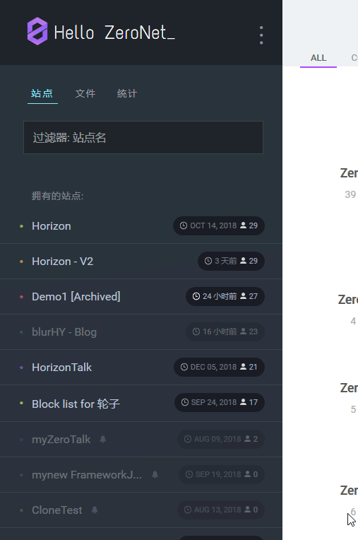
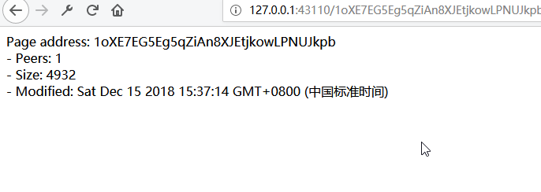

# 创建静态站点

本章讲述了如何创建站点——“关于我”。

## 创建空站点



创建完后弹出新站点。



-   _Page address_ 即 站点的公钥
-   _Peers_ 就是零网客户端已找到的且拥有你的站点的节点. _Peers_ 并不代表多少人访问过你的站点。
-   _Size_ 以字节为单位的 站点大小。

## `index.html`里有啥

打开站点中的`index.html`。先打开零网根目录:

-   对于 macOS，零网位于`~/Application Support/ZeroNet/` 或者 `ZeroNet.app` 的位置。
-   对于 Windows，在零网安装目录 (如 `C:\Program Files\ZeroNet\`).
-   如果你用 Git 安装零网，根目录就是 repo 的目录。

打开 `data` 目录，再打开以站点公钥为文件夹名的目录 (弹出的页面的网址，类似于 `1CyNApZ4zp7k3SSXsrW54vEFMHHBpDy3nm`)。其他目录就是零网网站的本地副本。

打开`index.html`:

```html
<!DOCTYPE html>

<html>
	<head>
		<title>New ZeroNet site!</title>
		<meta charset="utf-8" />
		<meta http-equiv="content-type" content="text/html; charset=utf-8" />
		<base href="" target="_top" id="base" />
		<script>
			base.href = document.location.href
				.replace("/media", "")
				.replace("index.html", "")
				.replace(/[&?]wrapper=False/, "")
				.replace(/[&?]wrapper_nonce=[A-Za-z0-9]+/, "");
		</script>
	</head>
	<body>
		<div id="out"></div>

		<script type="text/javascript" src="js/ZeroFrame.js"></script>
		<script>
			class Page extends ZeroFrame {
				setSiteInfo(site_info) {
					var out = document.getElementById("out");
					out.innerHTML =
						"Page address: " +
						site_info.address +
						"<br>- Peers: " +
						site_info.peers +
						"<br>- Size: " +
						site_info.settings.size +
						"<br>- Modified: " +
						new Date(site_info.content.modified * 1000);
				}

				onOpenWebsocket() {
					this.cmd("siteInfo", [], function(site_info) {
						page.setSiteInfo(site_info);
					});
				}

				onRequest(cmd, message) {
					if (cmd == "setSiteInfo") this.setSiteInfo(message.params);
					else this.log("Unknown incoming message:", cmd);
				}
			}
			page = new Page();
		</script>
	</body>
</html>
```

这东西不太容易理解，但先别急，咱先删点东西。

```html
<!DOCTYPE html>

<html>
	<head>
		<title>New ZeroNet site!</title>
		<meta charset="utf-8" />
		<meta http-equiv="content-type" content="text/html; charset=utf-8" />
		<base href="" target="_top" id="base" />
		<script>
			base.href = document.location.href
				.replace("/media", "")
				.replace("index.html", "")
				.replace(/[&?]wrapper=False/, "")
				.replace(/[&?]wrapper_nonce=[A-Za-z0-9]+/, "");
		</script>
	</head>
	<body></body>
</html>
```

这样好点了，移除了一些对咱来说没啥用的脚本。再重新缩进一下。

```html
<!DOCTYPE html>
<html>
	<head>
		<title>New ZeroNet site!</title>
		<meta charset="utf-8" />
		<meta http-equiv="content-type" content="text/html; charset=utf-8" />
		<base href="" target="_top" id="base" />
		<script>
			base.href = document.location.href
				.replace("/media", "")
				.replace("index.html", "")
				.replace(/[&?]wrapper=False/, "")
				.replace(/[&?]wrapper_nonce=[A-Za-z0-9]+/, "");
		</script>
	</head>
	<body></body>
</html>
```

**除了 `<base>` 和边上的 `<script>`，其他的都可以删改。** 每个零网站点都运行在沙盒`<iframe>`里，一些如 _localStorage_ 就不能用了。

不要删除 `js/ZeroFrame.js` 文件，你的站点可能用不到，但几乎所有的零网网站的需要这个文件。

## 小技巧

### 禁用缓存

编辑文件后，浏览器中的网页并没有任何变化，这是因为有缓存。打开`开发者工具`，里面应该有选项禁用缓存。

-   对于 Firefox，按 F12 打开`开发者工具`，点击 右上角的 Settings 图标 ，并选择 `Disable HTTP cache`
-   对于 Chrome, 按 F12 打开`开发者工具`，再按 F1, 点击左导航栏的 _Preferences_ ，并选择 *Network*菜单中的 `Disable cache`

### 无法使用绝对路径

先创建一些`<div>`并引入 css。

添加 `<div>1</div>` 到 `index.html`， `1` 就有了。

再创建文件 `css/index.css` ，包含下列内容：

```css
div {
	color: red;
}
```

...并引入到 `index.html`中：

```html
<link rel="stylesheet" href="/css/index.css" type="text/css" />
```

没啥变化，为啥呢？看地址: `http://127.0.0.1:43110/1CyNApZ4zp7k3SSXsrW54vEFMHHBpDy3nm/`。 `/css/index.css` 计算后成了 `http://127.0.0.1:43110/css/index.css`. 所以在零网中绝对路径不可用，那么就把 `<link>` 改成：

```html
<link rel="stylesheet" href="css/index.css" type="text/css" />
```

### `<iframe>`元素没法用

每个零网网页都包含下列代码：

    <script>
    // If we are inside iframe escape from it
    if (window.self !== window.top) window.open(window.location.toString(), "_top");
    if (window.self !== window.top) window.stop();
    if (window.self !== window.top && document.execCommand) document.execCommand("Stop", false)
    </script>

所以不能把其他零网的网页放在 `<iframe>` 里，连自己的站点的网页都不能放。

## 设计

这个你自己设计，不过你可以看看我的 [downloads](downloads/portfolio.zip).

## 站点设置

在侧边栏里设置站点描述和标题，看到右上角的`0`按钮了吗？点击按钮就会返回到 _ZeroHello_，往左拽试试:

```
      _____              _____
     /     \            /     \
    |   0   | <------- |   0   |
     \_____/            \_____/

```

侧边栏就会弹出，显示了已连接的节点数、文件、数据库信息，还有你的 ID 的地址 (登陆 _ZeroID_ 、 _KaffieID_ 、 _CryptoID_ 后就会变). 站长也可以改变站点信息。

滚动到底部编辑 `站点标题` 和 `站点描述` 参数，编辑完后要点 `保存站点设置`,设置就保存在 `content.json`里了，注意到这个文件了吗? 这个文件包含你的站点信息、设置等。

点击侧边栏最底下的`签名并发布`，
然后就会弹出`内容发布失败。`，
这很正常，现在只有你有这个站点。
等别人来下载你的站点就行。

如果你有固定 IP 或者打开了 tor，别人就可以下载你的站点，若是你想关电脑，就访问 `0net.io`: `https://0net.io/{站点公钥}/` (侧边栏中的站点地址)后再关。
可用代理: [0net.io](https://0net.io), [@amorgan's proxy](http://zn.amorgan.xyz) 以及 [ZeroGate](https://zerogate.tk).

## .bit 地址

如果你想要个域名像 `ivanq.bit`, 用 _Namecoin_，这个不将，教程自己找。
