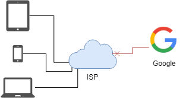
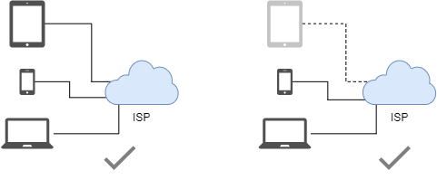

# 前言

本文改编自 [The-truth-about-zeronet](https://github.com/imachug/The-Truth-about-ZeroNet)。

!!! tip
    官方文档（已被墙）：<https://zeronet.io/docs/zh/>

    还有在零网上的镜像（官方的）：<http://127.0.0.1:43110/1DocsYf2tZVVMEMJFHiDsppmFicZCWkVv1/zh/>

## 站点

零网站点，又称 zite[^1]，正如其名，站点在分布式网络上分发。

### 抗墙能力

#### 常规互联网

网站容易被墙。

#### 零网

网站在每个访问者的设备上都有，难以屏蔽。

## 安装

要在 Windows，Mac 和 Linux 上使用零网，先得安装客户端。

{--访问 `https://zeronet.io` 并下载安装。--}

{++在大陆地区，可以在github上下载，<https://github.com/HelloZeroNet/ZeroNet-win/tree/dist>++}

## 访问站点

零网在本地架设服务器于 {==<http://127.0.0.1:43110>==} 。启动零网会自动打开浏览器。

你可以在左侧列表看到已下载的网站和一些链接，现在就打开看看吧。

至于为何说是 **下载** ，这跟零网的原理有关，待会再解释。

## 注册 ZeroID

用户可以在互联网[^2] 上如 Google, eBay，等网站上注册账号。而零网上注册账号，技术上是不可行的，相应的，零网引入了 **证书授权站**[^3]。 例如，[ZeroID](http://127.0.0.1:43110/1iD5ZQJMNXu43w1qLB8sfdHVKppVMduGz/)，是使用得最广泛的证书授权站点，就先在这注册吧。

访问 [ZeroID](http://127.0.0.1:43110/1iD5ZQJMNXu43w1qLB8sfdHVKppVMduGz/) 并注册 

!!! warning 
    如果要匿名，即隐藏IP，可以使用Tor

输入了昵称，密码呢？答案是——自动生成。零网根目录下有个 `users.json` 文件，注册的新账号会放在里面 : 私钥和公钥，还有昵称。不要泄露私钥给别人 - 私钥是密码。公钥就是账号。 如果 `users.json` 丢失或者被篡改，就没法访问你的账号了。所以要经常备份。

## 获取 ZeroTalk 账号

现在看下能用 ZeroID 的站点，论坛 ZeroTalk 是个很好的选择，

访问 [ZeroTalk](http://127.0.0.1:43110/1TaLkFrMwvbNsooF4ioKAY9EuxTBTjipT/)，点击 Test messages 帖子， 再点 **登陆为...** 选择 `{你的用户名}@zeroid.bit`。输入一些 `Hello, world!` 之类的文本再点击提交。 不想发 `Hello, world!` 的话，也可以发一下本教程 :)

可以点击顶部 `Forums: English · Dansk · Español · Français ...` 菜单栏选择相应论坛。中文论坛 [New GFW Talk](http://127.0.0.1:43110/19BPUZYAdCMxExKHoVSG3cG95wfUfFTEC9/) 。

## 关于作者

原作者：[imachug](https://github.com/imachug)、[krixano](https://github.com/krixano)

译者：[blurHY](https://github.com/blurhy)

具体的要看github repo。

[^1]:**Z**eroNet S**ite**
[^2]:指常规的、中心化的互联网。
[^3]:Certificate Authorities